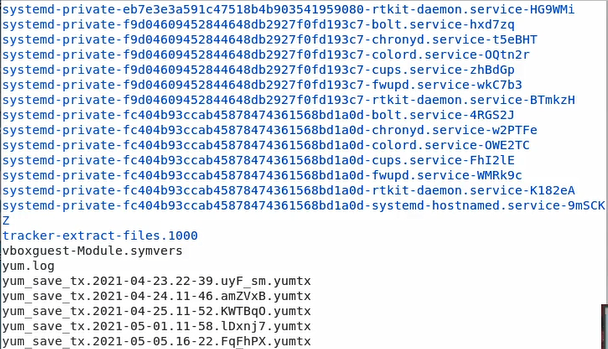
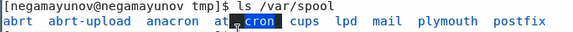
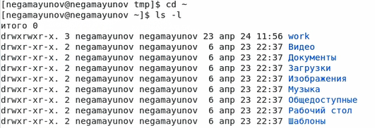
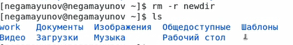

<!-- _class: titleslide -->
# Лабораторная работа №5
### Выполнил Гамаюнов Никита, 1032201719, НПМбд-01-20

---
# Прагматика выполнения работы
**Цель:** Приобретение практических навыков взаимодействия пользователя с системой посредством командной строки.
**Задача:**  На практике применить знания о командной строке в Linux.

---

# Процесс выполнения лабораторной работы:
Определил полное имя домашнего каталога

Перешёл в каталог /tmp 
 

---
С помощью команды ls получил информацию о его содержимом

---

Определил, есть ли в каталоге var/spool подкаталог с именем cron. Есть.
   

Перешел в домашний каталог и поределил, кто является владельцем файлов в нём. Оказалось, им являюсь я.
   

---
Создал одной командой каталоги letters, memos и misk. Затем удалил их одной командой.

---
Попробовал удалить ранее созданный каталог ~/newdir, в котором содержалась директория morefun, командой rm. С помощью ключа -r это получилось сделать.

С помощью команды man узнал больше о других командах.

---

<!-- _class: titleslide -->
# Выводы
Я приобрел практические навыки взаимодействия пользователя с системой посредством командной строки.
