# Лабораторная работа №5
## По дисциплине Операционнные системы
### Выполнил Гамаюнов Н.Е., студент ФФМиЕН РУДН, НПМбд-01-20, 1032201717
### Преподаватель Кулябов Дмитрий Сергеевич
### Москва, 2021 г.

# Цель работы
Приобретение практических навыков взаимодействия пользователя с системой посредством командной строки.

# Выполнение лабораторной работы
1. Определил полное имя домашнего каталога *(рисунок 1)*

    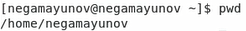

    *рисунок 1*

2. Перешёл в каталог /tmp *(рисунок 2)*
 
    

    *рисунок 2*

3. Воспользовался командой ls для получения информации о содержимом каталога:
- Без ключей - стандартная информация *(рисунок 3)*
- С ключем -a - показаны также скрытые файлы *(рисунок 4)*
  
  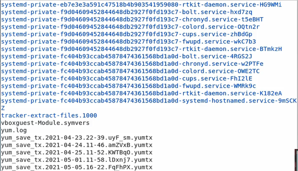

  *рисунок 3*

  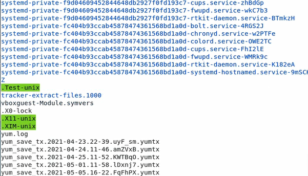

    *рисунок 4*

4. Определил, есть ли в каталоге var/spool подкаталог с именем cron. Есть. *(рисунок 5)*
   
    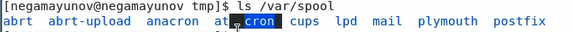

    *рисунок 5. Синим подсвечены названия каталогов.*

5. Перешел в домашний каталог и поределил, кто является владельцем файлов в нём. Оказалось, им являюсь я *(рисунок 6)*
   
    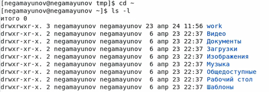

    *рисунок 6*

6. Создал ковый каталог newdir *(рисунок 7)*

    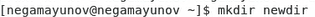

    *рисунок 7*

7. В каталоге newdir создал подкаталог morefun *(рисунок 8)*

    

    *рисунок 8*

8. Создал одной командой каталоги letters, memos и misk *(рисунок 9)*. Затем удалил их одной командой *(рисунок 10)*

    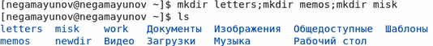

    *рисунок 9*

    
    

    *рисунок 10*

9. Попробовал удалить каталог ~/newdir командой rm. С помощью ключа -r это получилось сделать *(рисунок 11)*.

    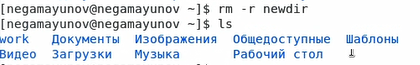

    *рисунок 11*

10. Я уже удалил каталог morefun, ведь в прошлом пункте воспользовался рекурсивным удалением.
11. С помощью команды man выяснил, какая опция команды ls помогает рекурсивно отображать подкаталоги проверяемого каталога *(рисунок 12)*.

    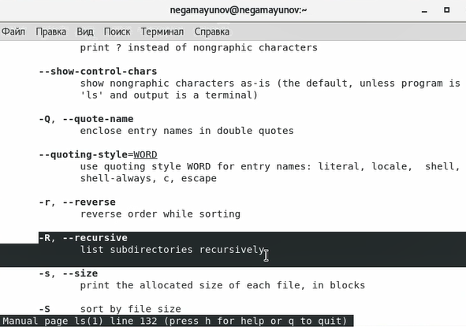

    *рисунок 12*

12. Требовалось, используя команду man, определить набор ключей для команды ls, которые позволяют отсортировать выводимые в расширенном формате данные по времени.
    - Из методический материалов я уже знаю, что за вывод расширенной информации отвечает опция l
    - С помощью команды man мной была найдена опция sort, позволяющая, например, отсортировать файлы по времени *(рисунок 13)*.

    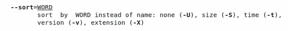

    *рисунок 13*

13. С помощью команды man просмотрел описания команд  cd, pwd, mkdir, rmdir, rm *(рисунок 14)*.
- **cd** позволяет сменить каталог, относительно которого будут выполняться дальнейшие команды (каталог, в котором "находится" пользователь)
- **pwd** отображает полный путь до текущего каталога
- **mkdir** позволяет создать каталог, **rmdir** - удалить.
- **rm** позволяет удалять файлы или каталоги.
      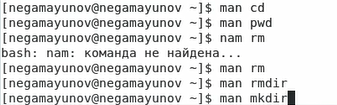

    *рисунок 14*

# Выводы
Я приобрел практические навыки взаимодействия пользователя с системой посредством командной строки.